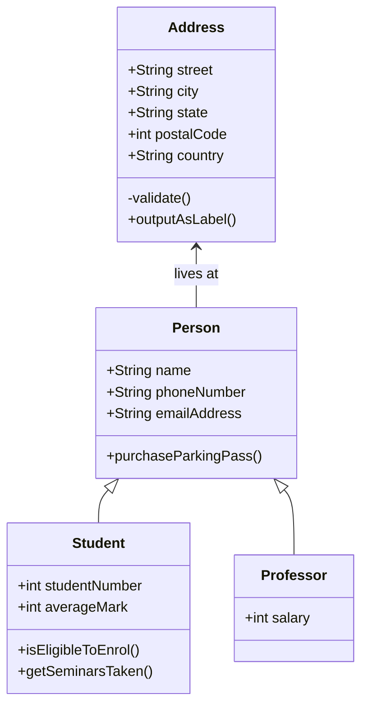

# Homepage

For full documentation visit [mkdocs.org](https://www.mkdocs.org).

## Code Annotation Examples

### Codeblocks

Some `code` goes here

### Plain codeblock

a plain codeblock:

```js

Some code here
function myFunc() {
    console.log("Hello world")
}

// some comment
```


