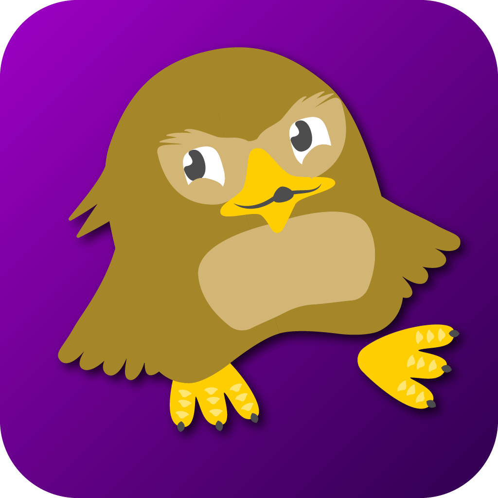

# Welcome to Questivity

**Questivity** is an innovative gamification platform specifically designed to integrate seamlessly with Canvas LMS networks. Our platform enhances the learning experience by incorporating engaging, gamified elements that transform traditional educational environments into interactive learning experiences.

---

    
    

        
    

    
    

        <h2 style="margin: 0; font-size: 30px; color: #333;">Questivity</h2>
        
Version 1.0

        
Questivity enhances learning through interactive games, quizzes, and activities, making education engaging and enjoyable.

    

    

        <a href="https://github.com/CS-3337-Group-8/Questivity" style="text-decoration: none;">
            <button style="background: linear-gradient(135deg, #007aff, #00d4ff); color: white; font-size: 20px; padding: 10px 20px; border: none; border-radius: 8px; cursor: pointer; box-shadow: 0 4px 10px rgba(0, 0, 0, 0.1); text-shadow: 1px 1px 2px rgba(0, 0, 0, 0.2); transition: background 0.3s ease, transform 0.2s ease; line-height: 1.3;">
                Get Started
            </button>
        </a>
    

---

## Overview

**Questivity** utilizes the Learning Tools Interoperability (LTI) standard, enabling seamless integration with a variety of Learning Management Systems (LMS). Our platform is focused on user engagement and aims to foster an interactive learning atmosphere through gamified elements. With Questivity, educators can easily create and manage captivating content that motivates students and enhances their learning outcomes.

---

## Transform Your Learning Experience

**Questivity** brings game mechanics to education, making learning more enjoyable and effective. Discover how our platform can make a difference in classrooms and online learning environments!

    

        <h3>Engaging Quizzes</h3>
        
Gamified quizzes that challenge students and provide instant feedback to keep them motivated and engaged in their learning process.

    

    

        <h3>Interactive Challenges</h3>
        
Students can participate in interactive challenges to enhance their understanding and skills, fostering a sense of competition and achievement.

    

    

        <h3>Real-Time Analytics</h3>
        
Get insights into student performance and engagement with our comprehensive analytics tools, allowing educators to make data-driven decisions.

    

    

        <h3>Customizable Features</h3>
        
Easily adapt our platform to fit your specific educational needs and objectives with customizable settings and content options.

    

---

## Why Choose Questivity?

-   **Enhance Student Engagement:** By incorporating game elements into the learning process, Questivity keeps students engaged and encourages active participation.
-   **Boost Learning Outcomes:** Research shows that gamified learning can lead to improved retention rates and academic performance.
-   **User-Friendly Interface:** Our platform is designed with educators and students in mind, ensuring an intuitive and smooth experience for everyone.
-   **Support & Resources:** We offer comprehensive support and resources to help you maximize the potential of Questivity in your educational environment.

---

## Join the Questivity Community!

Embark on a journey to revolutionize education through gamification. Whether you’re an educator looking to enhance your classroom experience or an institution aiming to improve student engagement, Questivity is here to support you.

### [Get Started with Questivity Today](https://github.com/CS-3337-Group-8/Questivity)
