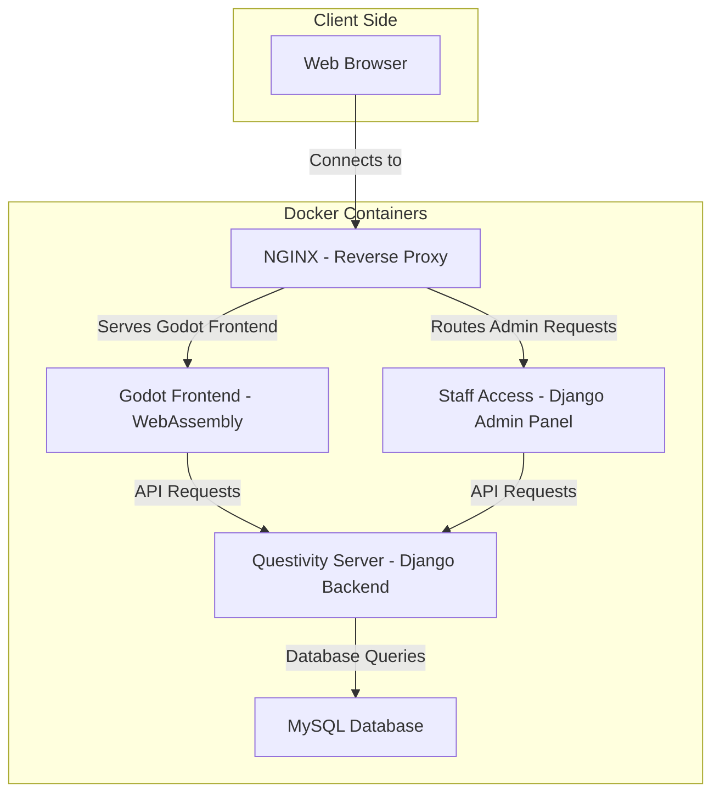

# Project Architecture

The **Questivity** platform is built on a modular, containerized architecture using Docker. Each component operates in its own Docker container, ensuring separation of concerns, scalability, and maintainability. Below is a detailed breakdown of the system architecture and the interaction between the services.

---

## High-Level Architecture Overview

-   **Client**: End users connect via a web browser.
-   **NGINX**: Acts as a reverse proxy, serves static content (Godot frontend), and routes API requests to the Questivity Server (Django backend).
-   **Godot Frontend**: Compiled to WebAssembly (WASM) for high-performance interactive experiences within the browser.
-   **Questivity Server (Django Backend)**: Manages backend logic, processes API requests, and interacts with the MySQL database.
-   **MySQL Database**: Stores user data, game progress, and application states.
-   **Staff Access (Django Admin Panel)**: Staff (admins and teachers) use the Django Admin interface for administrative and course management tasks.



## Project Directory Structure

```plaintext
questivity/
├── docker/
│   ├── .env
│   ├── heimdall/
│   ├── nginx/
│   │   └── nginx.conf
│   └── compose.yml
├── documentation/
│   ├── docs/
│   └── mkdocs.yml
├── godot/
├── questivity-server/
│   ├── server/
│   ├── static/
│   ├── users/
│   └── Dockerfile
├── dockermenu.py
└── gitmenu.py
```

### Directory and File Descriptions

-   **`docker/`**: Contains Docker Compose configuration files for managing the containerized environment.

    -   **`.env`**: Defines environment variables for Docker containers, such as credentials and configurations.
    -   **`heimdall/`**: Configuration files related to the Heimdall service (currently not in use).
    -   **`nginx/nginx.conf`**: NGINX configuration specifying request routing and static file serving.
    -   **`compose.yml`**: Primary Docker Compose configuration file that orchestrates the setup and linkage of containers.

-   **`documentation/`**: Contains configuration and files for generating the documentation site.

    -   **`docs/`**: Markdown files that compose the documentation pages.
    -   **`mkdocs.yml`**: MkDocs configuration specifying site generation options like navigation and theming.

-   **`godot/`**: Contains the Godot project files, including assets and scripts, compiled into WebAssembly for the frontend.

-   **`questivity-server/`**: Contains Django backend project files responsible for backend logic.

    -   **`server/`**: Houses the Django configuration files, including settings, middleware, and URL routing.
    -   **`static/`**: Static assets used by the Questivity Server (Django backend), such as CSS, JavaScript, and images.
    -   **`users/`**: Custom user model and authentication logic for the backend.
    -   **`Dockerfile`**: Dockerfile for building the Questivity Server container, detailing dependencies and application setup.

-   **`dockermenu.py`**: Interface for managing Docker Compose tasks (e.g., start, stop, and build containers).

-   **`gitmenu.py`**: Interface for managing Git version control tasks such as pull, push, and branch management.

---

## Component Overview

### 1. **Godot Frontend (WebAssembly)**

-   The **Godot Frontend** is developed using the Godot engine and compiled to **WebAssembly (WASM)** for optimal performance in the browser.
-   It interfaces with the Questivity Server (Django backend) via **RESTful API** calls to dynamically interact with backend services.
-   **NGINX** serves the static WebAssembly assets, allowing them to be rendered efficiently within the browser.

### 2. **NGINX (Web Server and Reverse Proxy)**

-   **NGINX** functions as both a **static content server** and a **reverse proxy**.
    -   Serves the Godot-generated WebAssembly and frontend assets.
    -   Routes API requests from the Godot frontend to the Questivity Server (Django backend).
-   Manages SSL termination and ensures secure and efficient communication between the frontend and backend.

### 3. **Questivity Server (Django Backend)**

-   The **Questivity Server** is built with Django and manages the core backend logic, including user authentication, API handling, and database interactions.
-   It exposes a **RESTful API** for the Godot frontend to communicate with, handling data such as game progress, user information, and other backend processes.
-   Uses **Django ORM** to interface with the **MySQL database**, abstracting SQL queries and ensuring efficient data management.
-   **Staff Access via Django Admin Panel**:
    -   Admins and teachers access the **Django Admin Panel** via a dedicated staff login.
    -   **Admins** use the admin panel to perform system administration tasks, manage users, survey data, and review student performance.
    -   **Teachers** manage courses, view student performance, manage course data, and input information used to generate games from the course content.

### 4. **MySQL Database**

-   The **MySQL database** stores all persistent data, including user profiles, game progress, and application states.
-   The Questivity Server interacts with MySQL through the Django ORM, enabling smooth CRUD operations.

---

## Build and Deployment Process

### 1. **Docker Containerization**

-   The Questivity platform is fully containerized using **Docker**. Each component (NGINX, Godot, Questivity Server, MySQL) runs in its own container, ensuring isolation and modularity.
-   **Docker Compose** orchestrates the containers, defining the services and their interactions in the `compose.yml` file.

**Build Process:**

-   **Questivity Server**: The Django backend container builds its dependencies, migrates the database schema, and starts the backend server.
-   **MySQL**: The database service is initialized using environment variables (e.g., `MYSQL_USER`, `MYSQL_PASSWORD`).
-   **NGINX**: Configured to serve the Godot frontend and route API requests to the Questivity Server.
-   **Godot**: Exports the frontend as WebAssembly, which is served statically by NGINX.

### 2. **Build Workflow**

-   **Questivity Server Dockerfile**: Defines the backend’s Python dependencies and runtime environment.
-   **Godot Export**: The Godot frontend is compiled into WebAssembly in a containerized environment, and the assets are served statically by NGINX.
-   **NGINX** serves the Godot frontend while forwarding backend API requests to the Questivity Server.

---

## Data Flow and Communication

### 1. **Client Requests (Browser to NGINX)**

-   The user accesses the Questivity platform via a web browser.
-   **NGINX** serves the Godot WebAssembly frontend and forwards any API requests from the frontend to the Questivity Server (Django backend).

### 2. **API Requests (NGINX to Questivity Server)**

-   NGINX proxies API requests from the Godot frontend to the Questivity Server based on URL paths defined in `nginx.conf`.

### 3. **Backend Processing (Questivity Server Logic)**

-   The **Questivity Server** processes incoming API requests, performs necessary authentication, and interacts with the MySQL database.
-   After processing, the server responds with data (typically in **JSON** format).

### 4. **Database Operations (Questivity Server and MySQL)**

-   The **MySQL database** processes queries and updates via the Django ORM in the Questivity Server.
-   The database service is isolated from direct access but is reachable by the Questivity Server via Docker’s internal network.

### 5. **Response Delivery (Questivity Server to Frontend)**

-   The Questivity Server packages the response data and sends it back to the Godot frontend via **NGINX**, allowing the frontend to update the user interface based on the backend's response.

---

## Summary of Data Flow

1. **User Action**: The user interacts with the Godot WebAssembly frontend.
2. **API Call**: The frontend sends an API request via NGINX to the Questivity Server.
3. **Backend Processing**: The Questivity Server processes the request and interacts with MySQL.
4. **Database Query**: MySQL returns the data to the Questivity Server, which sends it to the frontend.
5. **UI Update**: The Godot frontend updates based on the response from the Questivity Server.

---

This modular architecture ensures that the Questivity platform remains scalable, maintainable, and easy to develop, with each service running in its own Docker container for optimal performance and security. The **Django Admin Panel** provides staff with a robust interface for managing system tasks, courses, and content.
